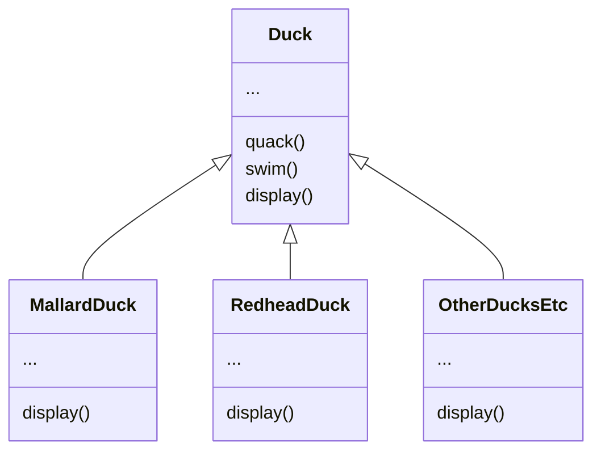
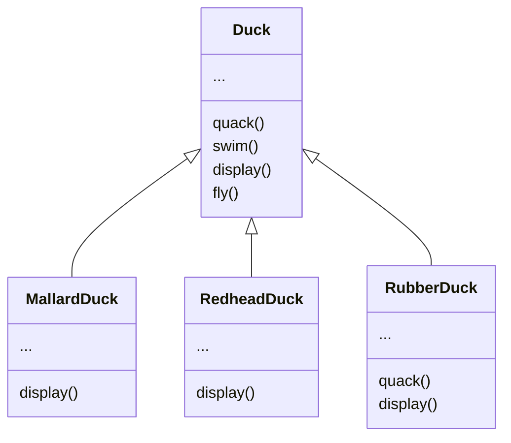
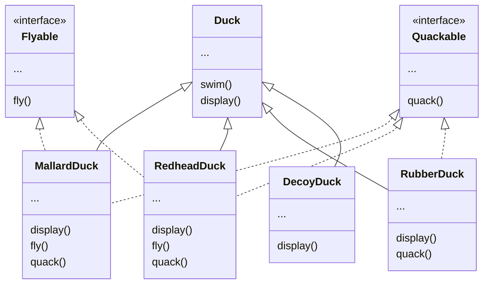
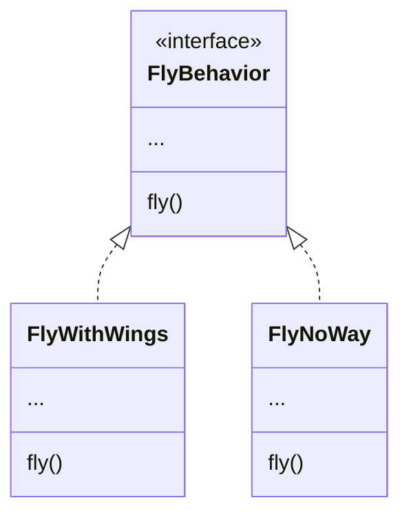
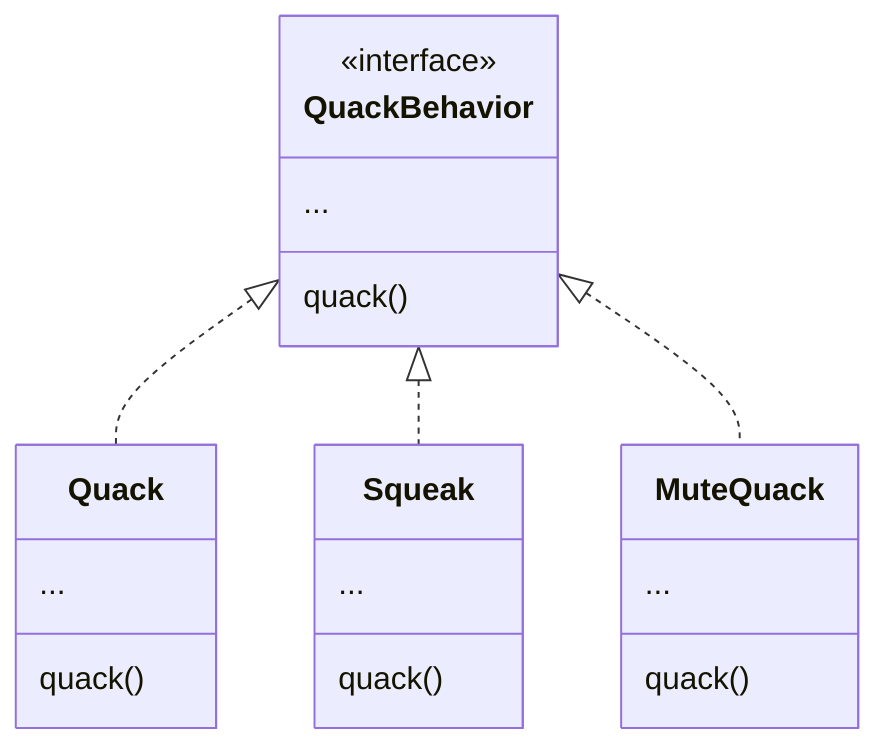
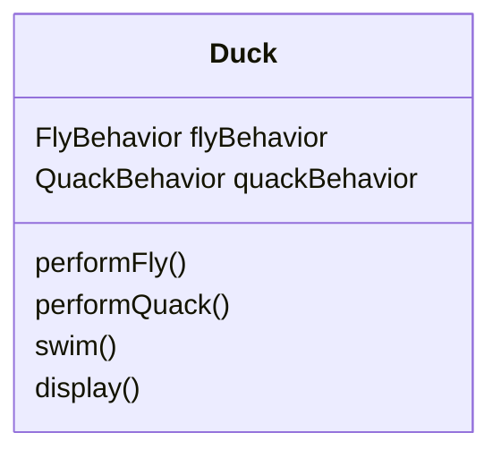

# Intro to Design Patterns
The best way to use patterns is to load your brain with them and then recognize places in your designs and existing applications where you can apply them. Instead of code reuse, with patterns you get experience reuse.

Example: A company makes a duck simulation game. The initial designers of the system used standard OO techniques and created one Duck superclass from which all other duck types inherit. The display() method in the Duck class in abstract, and each duck subtype is responsible for implementing its own display() behavior for how it looks on the screen. Lots of other types of ducks inherit from the Duck class. 



Now, the company needs the ducks to fly. 

## If we use inheritance...
If we add a fly() method in the Duck class and then all the ducks will inherit it. However, not all subclass of Duck should fly, such as a rubber duck. The quack() in the RubberDuck subclass also need to be overridden to "Squeak". This inheritance for reuse is difficult for maintenance. 



Although we can override the fly() method in rubber duck to do-nothing, like with the quack() method to squeak, but then if we need to add wooden-decoy-duck as a subclass, they aren't supposed to fly or quack, so we need to override them to do nothing, too. 

If the product has to be updated frequently, the spec keeps changing, and may need to override the fly() and quack() for every new duck subclass, forever. So we need to find a cleaner way to have only some of the duck types to fly or quack. 

## If we use interface...
If we take the fly() method out of the Duck superclass, and make a Flyable() interface with a fly() method inside, so that only the ducks that are supposed to fly will implement the interface and have a fly() method. And we can do the same for Quackable() interface with a quack() method inside:



The problem with this solution is duplicate code, and for example, if we need to make a change to the fly() behavior, we need to change it in all the duck subclasses that can fly - it destroys the code reuse for these behaviors, and thus creates problem for maintenance again. Java interfaces typically have no implementation code, so no code reuse.

The one thing that won't change in software development: No matter how well you design an application, over time an it must grow and change or it will die.

It would be great if we can build software in a way so that when we need to change it, we could do so with the least possible impact on the existing code. So we could spend less time reworking code and more making the program do cooler things. 

## So neither of them work...
In either case, whenever you need to modify a behavior, you have to track down and change it in all the different subclasses where that behavior is defined, probably introducing new bugs along the way. 

## Design Principle for this situation
**Design Principle 1**: From your application, identify `the aspects that vary` and `separate` them from `these that doesn't vary`. Take what varies and “encapsulate” it so it won’t affect those who won't change => Fewer code changes and hence bugs, and more flexibility in your systems. 

This concept forms the basis for almost every design pattern - they all provide a way to let some part of a system vary independently of all other parts.

## Apply this design principle
We know that fly() and quack() are the parts of the Duck class that vary across ducks. To separate these behaviors from the Duck class, we’ll `pull both methods out of the Duck class` and `create a new set of classes to represent each behavior`. Each set of classes (such as the Quacking-Behaviors set, and the Flying-behaviors set) will hold all the implementations of the respective behavior. For instance, in the Quacking-Behaviors set, we have one class that implements "quacking", another class that implements "squeaking", and another class that implements "silence".

## Another Design Principle
For flexibility, we should have behavior setter methods in the Duck classes so that we can change the MallardDuck’s flying behavior dynamically at runtime. But in the first two solutions, a behavior came either from a concrete implementation in the superclass Duck, or from a concrete implementation in the subclass itself - we were relying on an implementation, which doesn't allow for changes. 

**Design Principle 2**: Program to an interface (interface here means supertype, could be Java abstract class or Java interface), not an implementation. 

We’ll use an `interface` to represent each `behavior`. For instance, FlyBehavior and QuackBehavior, and each `implementation of a behavior` will implement one of those interfaces. We’ll make a set of classes whose entire reason for living is to `represent a behavior` (for example, “squeaking”), and it’s the `behavior class`, rather than the Duck class, that will `implement the behavior interface`. With our new design, the duck subclasses will use `a behavior represented by an interface` (FlyBehavior and QuackBehavior), so that the `actual implementation of the behavior` won’t be `locked` into the duck subclass.

Here, the fly() in the class FlyWithWings will implement duck flying, while the fly() in the class FlyNoWay will do nothing. 


Do the same to QuackBehavior: 



With this design, other objects can `reuse` fly and quack behaviors because they are taken out of the Duck classes. And we can `add new behaviors without` modifying existing behavior classes or the Duck classes that use flying behaviors.

Note: 
- The principles and patterns can be applied at any stage of the development lifecycle.
- Even a behavior can still have state and methods; a flying behavior might have instance variables representing the attributes for the flying (wing beats per minute, max altitude, speed, etc.) behavior.

## Integrating the Duck behaviors
Add two instance vars that are of behavior interface type. To perform the quack, a Duck just asks the object that is referenced by quackBehavior to quack for it. We don’t care who inherits Duck, all we care about is that it knows how to quack(). 



```java
public abstract class Duck {
  QuackBehavior quackBehavior; 
  // more
  public void performQuack() { 
    quackBehavior.quack(); 
  }
}
```


