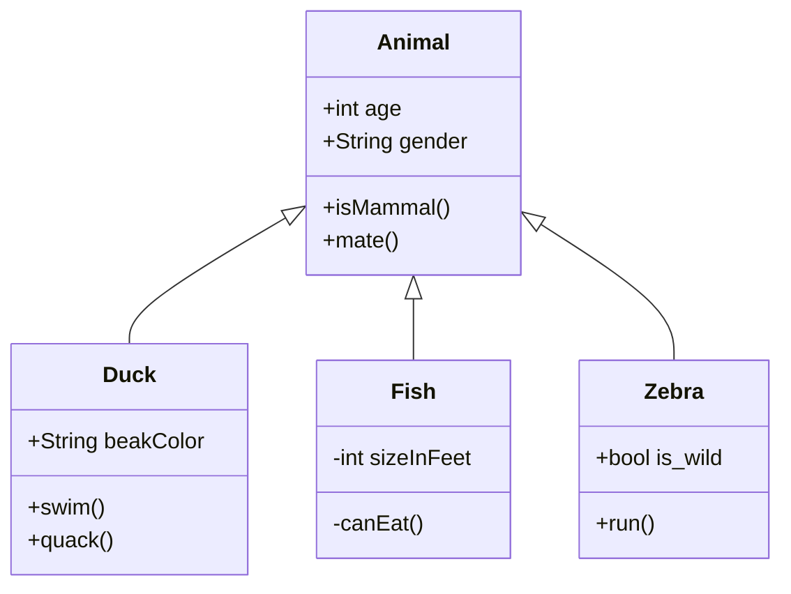

# Intro to Design Patterns
The best way to use patterns is to load your brain with them and then recognize places in your designs and existing applications where you can apply them. Instead of code reuse, with patterns you get experience reuse.

Example: A company makes a duck simulation game. The initial designers of the system used standard OO techniques and created one Duck superclass from which all other duck types inherit.

