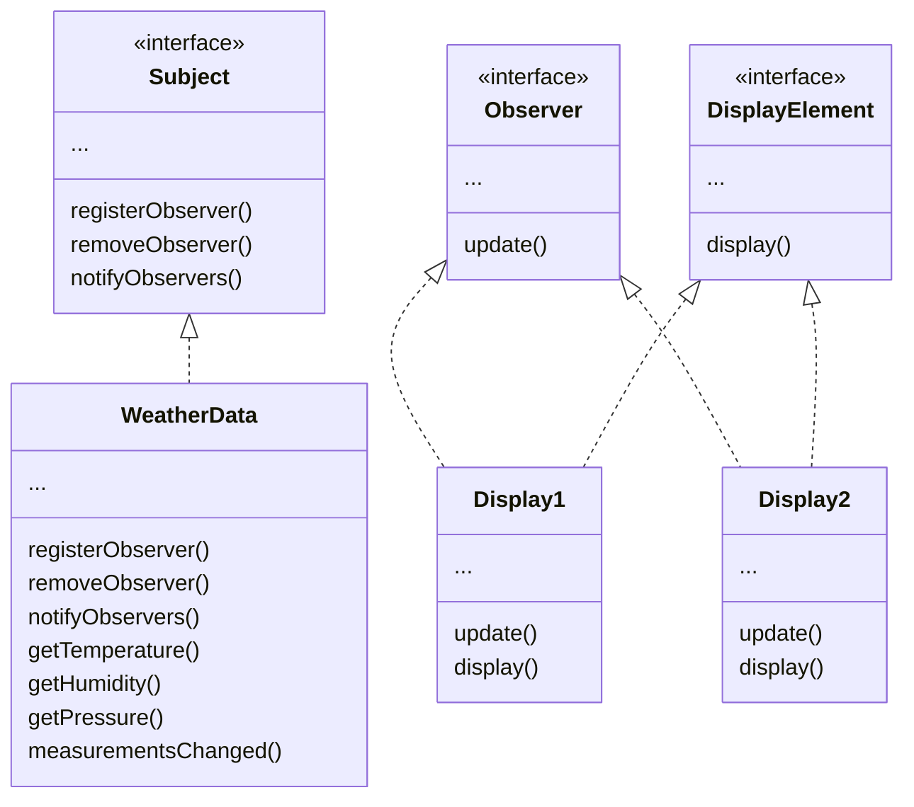

# 2. The Observer Pattern
Suppose you need to build a weather station app where different display elements will be updated based on the WeatherData object, which tracks temperature, humidity, etc. Moreover, the app needs to be expandable: it needs to allow other developers to create their own display elements. 

The app has three components: the physical weather station that measures the weather data, the WeatherData object that tracks the data from the station and updates the display elements, and the 3 display elements that shows the current weather conditions to the user. We need to design an app that uses the WeatherData object to update the displays. 

Whenever the WeatherData object gets updated data from the station, its measurementsChanged() method is called. We need to modify this method so it updates the displays. 

We expect, if the Weather Station is successful, there will be more than three displays in the future, so we create a marketplace for additional displays. Other developers may want to create new custom displays.

## Publishers + Subscribers = Observer Pattern
We call the publisher the Subject, and the subscribers the Observers. 

`The Observer Pattern` defines a one-to-many dependency between objects so that when one object changes state, all of its dependents are notified and updated automatically.

## The Observer Pattern: the class diagram


Each subject can have many observers. The observers use the state in the subjects, even if they don't own it, this. 

When two objects are loosely coupled, they can interact, but they typically have very little knowledge of each other. This gives us a lot of flexibility. The Observer Pattern is a great example of `loose coupling`. 
- the only thing the subject knows about an observer is that it implements a certain interface (the Observer interface).
- We can add new observers at any time.
- We never need to modify the subject to add new types of observers.
- We can reuse subjects or observers independently of each other. ???
- Changes to either the subject or an observer will not affect the other.

**Design Principle #4**: Strive for loosely coupled designs between objects that interact.

## Weather station class diagram


## Implementing the Weather station
```java
public interface Subject { 
    public void registerObserver(Observer o); 
    public void removeObserver(Observer o); 
    public void notifyObservers(); 
}

public interface Observer { 
    public void update(float temp, float humidity, float pressure); 
}

public interface DisplayElement {
    public void display();
}

public class WeatherData implements Subject { 
    private List<Observer> observers; 
    private float temperature; 
    private float humidity; 
    private float pressure;

    public WeatherData() { 
        observers = new ArrayList<Observer>(); 
    }

    public void registerObserver(Observer o) { 
        observers.add(o); 
    }

    public void removeObserver(Observer o) { 
        observers.remove(o); 
    }

    public void notifyObservers() { 
        for (Observer observer : observers) { 
            observer.update(temperature, humidity, pressure); 
        } 
    }

    public void measurementsChanged() { 
        notifyObservers(); 
    }

    public void setMeasurements(float temperature, float humidity, float pressure) {
        this.temperature = temperature; 
        this.humidity = humidity; 
        this.pressure = pressure; 
        measurementsChanged(); 
    }
    // other WeatherData methods here
}

public class CurrentConditionsDisplay implements Observer, DisplayElement { 
    private float temperature; 
    private float humidity; 
    private WeatherData weatherData; // can later be used for un-register

    public CurrentConditionsDisplay(WeatherData weatherData) { 
        this.weatherData = weatherData; 
        weatherData.registerObserver(this); 
    }

    public void update(float temperature, float humidity, float pressure) { 
        this.temperature = temperature; 
        this.humidity = humidity; 
        display(); 
    }

    public void display() { 
        System.out.println("Current conditions: " + temperature + "F degrees and " + humidity + "% humidity"); 
    }
}

public class WeatherStation {
    public static void main(String[] args) { 
        WeatherData weatherData = new WeatherData();

        CurrentConditionsDisplay currentDisplay = new CurrentConditionsDisplay(weatherData); 
        StatisticsDisplay statisticsDisplay = new StatisticsDisplay(weatherData); 
        ForecastDisplay forecastDisplay = new ForecastDisplay(weatherData);

        weatherData.setMeasurements(80, 65, 30.4f); 
        weatherData.setMeasurements(82, 70, 29.2f); 
        weatherData.setMeasurements(78, 90, 29.2f);
    }
}
```


