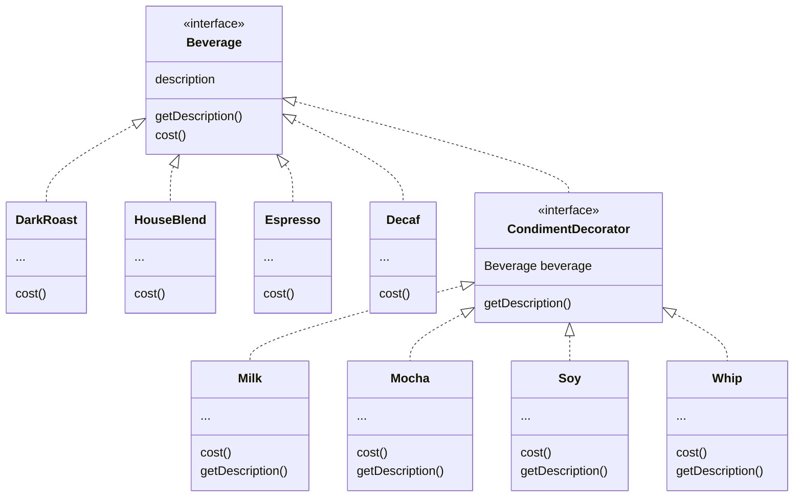

# 3. The Decorator Pattern
Once you know the techniques of decorating, you'll be able to give your/others objects new responsibilities without making any code changes to the underlying classes.

Assume a coffee shop has a growing number of beverage types. 

The original classes design: multiple beverage types inherit from an abstract class called beverage, and each concrete class need to implement cost() method, and has its own description instance variable. 

The problem: class explosions, and maintenance problem: if the price of one condiment changes, or a new condiment is introduced. If we use instance variables and inheritance in the superclass to keep track of the condiments cost, then it makes it hard for future changes, eg, condiment price changes or adding new condiments will cause existing code to be modified; some condiments do not fit in some beverages. 

While inheritance is powerful, it doesn't always lead to the most flexible/maintainable designs.

**Design Principle**: Classes should be open for extension, but closed for modification.

Making OO design flexible and open to extension without modifying existing code takes time and effort. In general, we don't have the luxury of tying down every part of our designs. Following the Open-Closed Principle usually introduces new levels of abstraction, which adds complexity to our code. You want to concentrate on those areas that are most likely to change in your designs and apply the principles there. Applying the Open-Closed Principle EVERYWHERE is wasteful and unnecessary, and can lead to complex, hard-to-understand code.

With the Decorator Pattern, we will start with a beverage and decorate it with the condiments at runtime. For example, if the customer wants a Dark Roast with Mocha and Whip:
1. Start with a DarkRoast object.
2. Decorate it with a Mocha object.
3. Decorate it with a Whip object.
4. Call the cost() method and rely on delegation to add up the condiment costs.

About decorators:
- Decorators have the same supertype as the objects they decorate.
- You can use one or more decorators to wrap an object.
- Given that the decorator has the same supertype as the object it decorates, we can pass around a decorated object in place of the original (wrapped) object.
- The decorator adds its own behavior before and/or after delegating to the object it decorates to do the rest of the job.
- Objects can be decorated at any time, so we can decorate objects dynamically at runtime with as many decorators as we like.

## The Decorator Pattern
The Decorator Pattern attaches additional responsibilities to an object dynamically. Decorators provide a flexible alternative to subclassing for extending functionality.

Note that we are subclassing the abstract class Beverage in order to have the correct type, not to inherit its behavior. The behavior comes in through the composition of decorators with the base components as well as other decorators.

With composition, we can mix and match decorators any way we like, at runtime.

