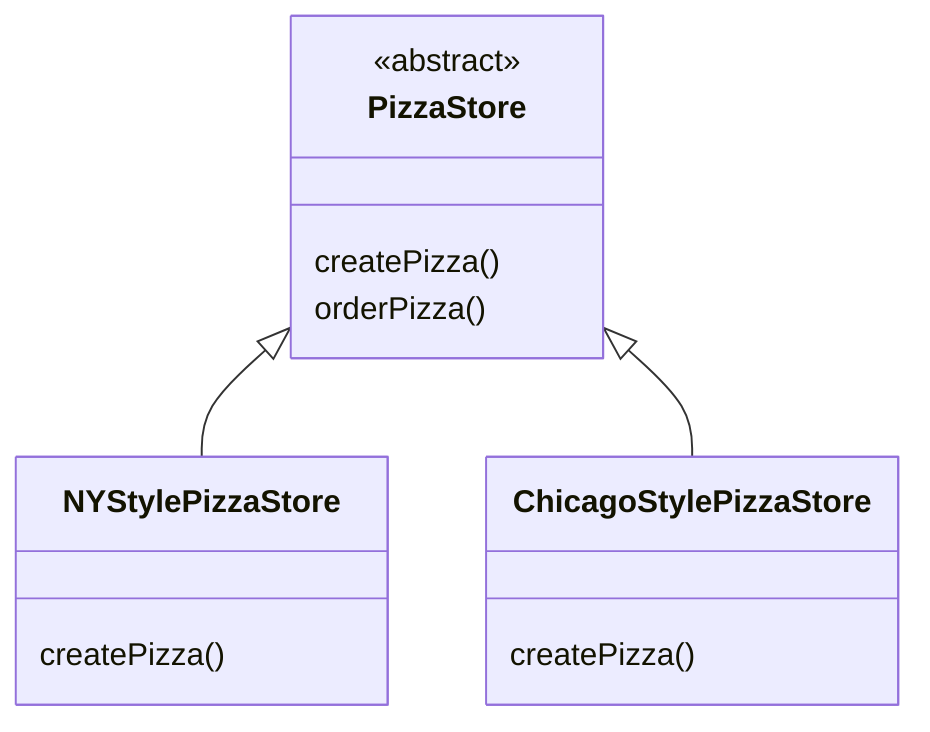

# The Factory Pattern
Object instantiation shouldn't always be done in public, and can often lead to coupling problems.

We want to use abstract types to keep code flexible, but we have to create an instance of a concrete class. And when we have many related concrete classes, often we end up with this:
```java
Duck duck;
if (picnic) { 
  duck = new MallardDuck(); 
} else if (hunting) {
  duck = new DecoyDuck(); 
} else if (inBathTub) {
  duck = new RubberDuck(); 
}
```

Here we have several concrete classes being instantiated, and the decision of which to instantiate is made at runtime, depending on some set of conditions. 

When you see code like this, you know that when it comes time for changes or extensions, you'll have to reopen this code, and examine what needs to be added/deleted. 

Often this kind of code ends up in several parts of the application, making maintenance/updates difficult and error-prone.

## The pizza shop example
We need to take the creation code and move it out into another object that is only going to be concerned with creating pizzas.

Factories handle the details of object creation. Gone are the days when the orderPizza() method needs to know about Greek versus Clam pizzas. Now the orderPizza() method just cares that it gets a pizza that implements the Pizza interface, so that it can call prepare(), bake(), cut(), and box().

```java
public class PizzaStore { 
  SimplePizzaFactory factory;
  public PizzaStore(SimplePizzaFactory factory) { 
    this.factory = factory; 
  }
  public Pizza orderPizza(String type) { 
    Pizza pizza;
    pizza = factory.createPizza(type);
    pizza.prepare(); 
    pizza.bake(); 
    pizza.cut(); 
    pizza.box();
    return pizza;
  }
  // other methods here
}

public class SimplePizzaFactory {
  public Pizza createPizza(String type) {
    Pizza pizza = null; 
    if (type.equals("cheese")) {
      pizza = new CheesePizza(); 
    } else if (type.equals("pepperoni")) {
      pizza = new PepperoniPizza(); 
    } else if (type.equals("clam")) {
      pizza = new ClamPizza(); 
    } else if (type.equals("veggie")) {
      pizza = new VeggiePizza(); 
    } 
    return pizza;
  }
}
```

The SimplePizzaFactory class may have many clients, including orderPizza() method. So, by encapsulating the pizza creation in one class, we now have only one place to make modifications when the implementation changes. We also remove the concrete instantiations from our client code.

The Simple Factory is't actually a Design Pattern; it's more of a programming idiom.

In design patterns, "implement an interface" does NOT always mean literally using the implements keyword in the class declaration. A concrete class implementing a method from a supertype (which could be a abstract class/interface) is still considered to be "implementing the interface" of that supertype.

## The pizza store expands
Now assume the pizza store expands to a chain a stores. Each franchise want to offer different styles of pizzas, depending on location.

If we take out SimplePizzaFactory, and create three different factories - NYPizzaFactory, ChicagoPizzaFactory, and CaliforniaPizzaFactory - then we can just compose the PizzaStore with the appropriate factory, and a franchise is good to go.

But, what if you want to create a framework, that ties the store and the pizza creation together, yet still allows things to remain flexible.

What we are going to do is, make the PizzaStore class abstract, put createPizza() method into PizzaStore, and make this method abstract. Then we can create a concrete PizzaStore subclass for each regional style:
```java
public abstract class PizzaStore { // the Creator classes
  public Pizza orderPizza(String type) { // this part is fixed
    Pizza pizza;
    pizza = createPizza(type); // calling its own createPizza()
    pizza.prepare(); 
    pizza.bake(); 
    pizza.cut(); 
    pizza.box();
    return pizza;
  }

  // let each subclass of Pizza Store define their createPizza(). This is the factory method
  protected abstract Pizza createPizza(String type); // this part is flexible
}
```

In this way, we will have many concrete subclasses of Pizza Store, each with its own pizza variations, all fitting within the Pizza Store framework, and still making use of the well-tuned orderPizza() method.



Note that the orderPizza() method does many with a Pizza object (prepare/bake/cut/box), but because Pizza is abstract, orderPizza() has no idea what real concrete classes are involved. In other words, it's decoupled. 

Concrete subclasses of Pizza Stores. Example of the New York regional style:
```java
public class NYPizzaStore extends PizzaStore {
  Pizza createPizza(String item) {
    if (item.equals("cheese")) { 
      return new NYStyleCheesePizza(); 
    } else if (item.equals("veggie")) {
      return new NYStyleVeggiePizza(); 
    } else if (item.equals("clam")) {
      return new NYStyleClamPizza(); 
    } else if (item.equals("pepperoni")) {
      return new NYStylePepperoniPizza(); 
    } else return null;
  }
}
```

With this, we've gone from having an object handle the instantiation of our concrete classes, to a set of subclasses taking that responsibility.

`abstract Product factoryMethod(String type)`. A factory method handles object creation, and encapsulates/delegates it in a subclass. This decouples the client code in the superclass from the object creation code in the subclass.

The abstract Pizza class:
```java
public abstract class Pizza { // the Product classes
  String name; 
  String dough; 
  String sauce; 
  List<String> toppings = new ArrayList<String>();

  void prepare() { 
    System.out.println("Preparing " + name); 
    System.out.println("Tossing dough..."); 
    System.out.println("Adding sauce..."); 
    System.out.println("Adding toppings: "); 
    for (String topping : toppings) { System.out.println(" " + topping); }
  }

  void bake() { 
    System.out.println("Bake for 25 minutes at 350"); 
  }

  void cut() { 
    System.out.println("Cutting the pizza into diagonal slices"); 
  }

  void box() { 
    System.out.println("Place pizza in official PizzaStore box"); 
  }

  public String getName() { 
    return name; 
  }
}
```

And a concrete NYStyleCheesePizza class:
```java
public class NYStyleCheesePizza extends Pizza {
  public NYStyleCheesePizza() {
    name = "NY Style Sauce and Cheese Pizza"; 
    dough = "Thin Crust Dough"; 
    sauce = "Marinara Sauce";
    toppings.add("Grated Reggiano Cheese");
  }
}
```

A concrete ChicagoStyleCheesePizza class:
```java
public class ChicagoStyleCheesePizza extends Pizza {
  public ChicagoStyleCheesePizza() {
    name = "Chicago Style Deep Dish Cheese Pizza"; 
    dough = "Extra Thick Crust Dough"; 
    sauce = "Plum Tomato Sauce";
    toppings.add("Shredded Mozzarella Cheese");
  }
  void cut() { 
    System.out.println("Cutting the pizza into square slices"); 
  }
}
```

And the main:
```java
public class PizzaTestDrive {
  public static void main(String[] args) {
    PizzaStore nyStore = new NYPizzaStore(); 
    PizzaStore chicagoStore = new ChicagoPizzaStore();
    Pizza pizza = nyStore.orderPizza("cheese"); 
    System.out.println("Ethan ordered a " + pizza.getName() + "\n");
    pizza = chicagoStore.orderPizza("cheese"); 
    System.out.println("Joel ordered a " + pizza.getName() + "\n");
  }
}
```

## Summary
The Factory Method Pattern defines an interface for creating an object, but lets subclasses decide which class to instantiate. Factory Method lets a class defer instantiation to subclasses.

Design principle 
- Dependency Inversion Principle: Depend upon abstractions. Do not depend upon concrete classes.

It suggests that our high-level components should not depend on our low-level components; rather, they should both depend on abstractions. PizzaStore is our high-level component, and the pizza implementations are our low-level components, so PizzaStore should not depend on the concrete pizza classes, instead, it should depend on the abstract Pizza class.

After applying Factory Method, or high-level component, the PizzaStore, and our low-level components, the pizzas, both depend on Pizza, the abstraction.

The following guidelines can help you avoid OO designs, that violate the Dependency Inversion Principle:
- No variable should hold a reference to a concrete class. Should not use "new ...". 
- No class should derive from a concrete class. Should derive from an abstraction. 
- No method should override an implemented method of any of its base classes. Base classes are meant to be shared by all your subclasses. 

This is a guideline you should strive for, rather than a rule you should follow all the time.

But, if you internalize these guidelines, and have them in the back of your mind when you design, you'll know when you are violating the principle, and you'll have a good reason for doing so. For instance, if you have a class that isn't likely to change, and you know it, then it's not the end of the world, if you instantiate a concrete class in your code. If, on the other hand, a class you write is likely to change, you have some good techniques, like Factory Method, to encapsulate that change.

## How to make same type of stores use the same set of ingredients
Next, assume we want to standardize the ingredients that all pizza stores - all three regions have different ingredient families, with each region implementing a complete family of ingredients.  

Now we're going to build a factory to create our ingredients; the factory will be responsible for creating each ingredient in the ingredient family.

An interface for the factory, that is going to create all our ingredients:
```java
public interface PizzaIngredientFactory {
  public Dough createDough(); 
  public Sauce createSauce(); 
  public Cheese createCheese(); 
  public Veggies[] createVeggies(); 
  public Pepperoni createPepperoni(); 
  public Clams createClam();
}
```

Next, we will build a factory for each region, by creating a subclass of PizzaIngredientFactory, that implements each create method. We also implement a set of ingredient classes, to be used with the factory, like ReggianoCheese, RedPeppers, and ThickCrustDough. These classes can be shared among regions where appropriate.

The implementation for the New York ingredient factory:
```java
public class NYPizzaIngredientFactory implements PizzaIngredientFactory {

  public Dough createDough() { // the New York version
    return new ThinCrustDough(); 
  }

  public Sauce createSauce() { // the New York version
    return new MarinaraSauce(); 
  }

  public Cheese createCheese() { // the New York version
    return new ReggianoCheese(); 
  }

  public Veggies[] createVeggies() { 
    Veggies veggies[] = { new Garlic(), new Onion(), new Mushroom(), new RedPepper() }; 
    return veggies; 
  }

  public Pepperoni createPepperoni() { // quality pepperoni, shared between New York and Chicago
    return new SlicedPepperoni(); 
  }

  public Clams createClam() { // the New York version of fresh clams from the nearby coast, Chicago has to settle for frozen
    return new FreshClams(); 
  }
}
```

The reworked Pizza class:
```java
public abstract class Pizza { 
  // a set of ingredients used for it
  String name;
  Dough dough; 
  Sauce sauce; 
  Veggies veggies[]; 
  Cheese cheese; 
  Pepperoni pepperoni; 
  Clams clam;

  abstract void prepare(); // now is abstract

  void bake() { // didn't change 
    System.out.println("Bake for 25 minutes at 350"); 
  }

  void cut() { // didn't change 
    System.out.println("Cutting the pizza into diagonal slices"); 
  }

  void box() { // didn't change 
    System.out.println("Place pizza in official PizzaStore box"); 
  }

  void setName(String name) { // didn't change 
    this.name = name; 
  }

  String getName() { // didn't change 
    return name; 
  }

  public String toString() { // didn't change 
    // code to print pizza here 
  }
}
```

The CheesePizza class:
```java
public class CheesePizza extends Pizza { 
  PizzaIngredientFactory ingredientFactory;

  public CheesePizza(PizzaIngredientFactory ingredientFactory) { // let the factory to provide ingredients
    this.ingredientFactory = ingredientFactory; 
  }

  void prepare() { 
    System.out.println("Preparing " + name); 
    dough = ingredientFactory.createDough(); 
    sauce = ingredientFactory.createSauce(); 
    cheese = ingredientFactory.createCheese(); 
  }
}
```

The Pizza code uses the factory it has been composed with, to produce the ingredients used in the pizza. The ingredients produced depend on which factory we're using. The Pizza class doesn't care; it knows how to make pizzas. Now, it's decoupled from the differences in regional ingredients, and can be easily reused when there are factories for the Austin, the Nashville, and beyond.

The ClamPizza class:
```java
public class ClamPizza extends Pizza { 
  PizzaIngredientFactory ingredientFactory;

  public ClamPizza(PizzaIngredientFactory ingredientFactory) { 
    this.ingredientFactory = ingredientFactory; 
  }

  void prepare() {
    System.out.println("Preparing " + name); 
    dough = ingredientFactory.createDough(); 
    sauce = ingredientFactory.createSauce(); 
    cheese = ingredientFactory.createCheese(); 
    clam = ingredientFactory.createClam();
  }
}
```

Updated concrete PizzaStore class:
```java
public class NYPizzaStore extends PizzaStore {

  protected Pizza createPizza(String item) { 
    Pizza pizza = null; 
    PizzaIngredientFactory ingredientFactory = new NYPizzaIngredientFactory(); 

    if (item.equals("cheese")) { 
      pizza = new CheesePizza(ingredientFactory); 
      pizza.setName("New York Style Cheese Pizza"); 
    } else if (item.equals("veggie")) { 
      pizza = new VeggiePizza(ingredientFactory); 
      pizza.setName("New York Style Veggie Pizza"); 
    } else if (item.equals("clam")) { 
      pizza = new ClamPizza(ingredientFactory); 
      pizza.setName("New York Style Clam Pizza"); 
    } else if (item.equals("pepperoni")) { 
      pizza = new PepperoniPizza(ingredientFactory); 
      pizza.setName("New York Style Pepperoni Pizza"); 
    } 
    return pizza;
  }

}
```

Hence, we provided a way of creating a family of ingredients for pizzas, by introducing a new type of factory, called an Abstract Factory.

An Abstract Factory gives us an interface for creating a family of products. By writing code that uses this interface, we decouple our code from the actual factory that creates the products. That allows us to implement a variety of factories that produce products meant for different contexts, such as different regions, different operating systems, or different look and feels.

From the abstract factory, we derive one or more concrete factories that produce the same products, but with different implementations. We then write our code so that it uses the factory to create products. By passing in a variety of factories, we get a variety of implementations of those products. But our client code stays the same.

## Summary
The Abstract Factory Pattern provides an interface for creating families of related or dependent objects, without specifying their concrete classes.

The Abstract Factory allows a client to use an abstract interface to create a set of related products, without knowing about the concrete products that are actually produced. In this way, the client is decoupled from any of the specifics of the concrete products. 

The factory method creates objects via inheritance - to create objects using Factory Method, you need to extend a class, and provide an implementation for a factory method. The abstract factory method creates objects via object composition - it provides an abstract type for creating a family of products.

Methods to create concrete products in an Abstract Factory are often implemented with a Factory Method. 


