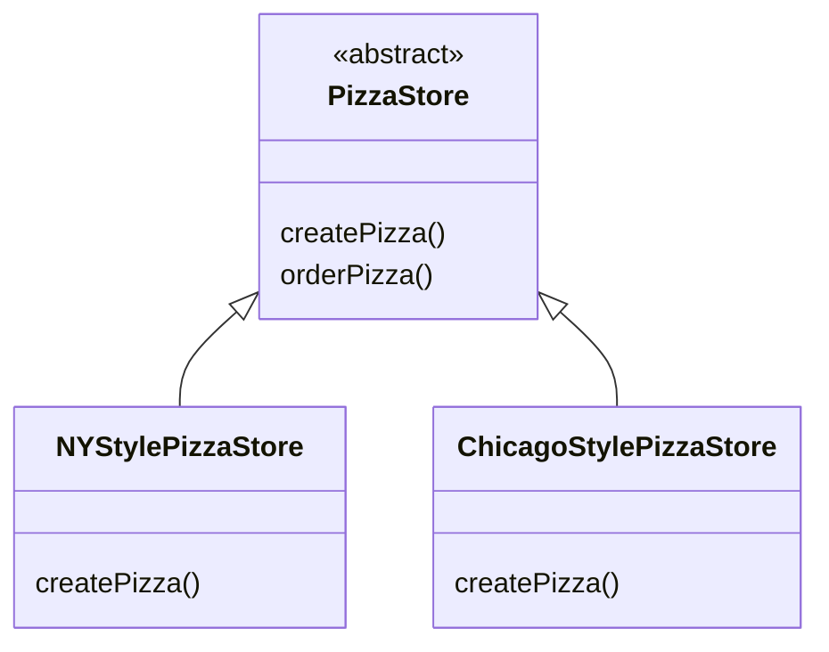

# The Factory Pattern
Object instantiation shouldn't always be done in public, and can often lead to coupling problems.

We want to use abstract types to keep code flexible, but we have to create an instance of a concrete class. And when we have many related concrete classes, often we end up with this:
```java
Duck duck;
if (picnic) { 
  duck = new MallardDuck(); 
} else if (hunting) {
  duck = new DecoyDuck(); 
} else if (inBathTub) {
  duck = new RubberDuck(); 
}
```

Here we have several concrete classes being instantiated, and the decision of which to instantiate is made at runtime, depending on some set of conditions. 

When you see code like this, you know that when it comes time for changes or extensions, you'll have to reopen this code, and examine what needs to be added/deleted. 

Often this kind of code ends up in several parts of the application, making maintenance/updates difficult and error-prone.

## The pizza shop example
We need to take the creation code and move it out into another object that is only going to be concerned with creating pizzas.

Factories handle the details of object creation. Gone are the days when the orderPizza() method needs to know about Greek versus Clam pizzas. Now the orderPizza() method just cares that it gets a pizza that implements the Pizza interface, so that it can call prepare(), bake(), cut(), and box().

```java
public class PizzaStore { 
  SimplePizzaFactory factory;
  public PizzaStore(SimplePizzaFactory factory) { 
    this.factory = factory; 
  }
  public Pizza orderPizza(String type) { 
    Pizza pizza;
    pizza = factory.createPizza(type);
    pizza.prepare(); 
    pizza.bake(); 
    pizza.cut(); 
    pizza.box();
    return pizza;
  }
  // other methods here
}

public class SimplePizzaFactory {
  public Pizza createPizza(String type) {
    Pizza pizza = null; 
    if (type.equals("cheese")) {
      pizza = new CheesePizza(); 
    } else if (type.equals("pepperoni")) {
      pizza = new PepperoniPizza(); 
    } else if (type.equals("clam")) {
      pizza = new ClamPizza(); 
    } else if (type.equals("veggie")) {
      pizza = new VeggiePizza(); 
    } 
    return pizza;
  }
}
```

The SimplePizzaFactory class may have many clients, including orderPizza() method. So, by encapsulating the pizza creation in one class, we now have only one place to make modifications when the implementation changes. We also remove the concrete instantiations from our client code.

The Simple Factory is't actually a Design Pattern; it's more of a programming idiom.

In design patterns, "implement an interface" does NOT always mean literally using the implements keyword in the class declaration. A concrete class implementing a method from a supertype (which could be a abstract class/interface) is still considered to be "implementing the interface" of that supertype.

## The pizza store expands
Now assume the pizza store expands to a chain a stores. Each franchise want to offer different styles of pizzas, depending on location.

If we take out SimplePizzaFactory, and create three different factories - NYPizzaFactory, ChicagoPizzaFactory, and CaliforniaPizzaFactory - then we can just compose the PizzaStore with the appropriate factory, and a franchise is good to go.

But, what if you want to create a framework, that ties the store and the pizza creation together, yet still allows things to remain flexible.

What we are going to do is, make the PizzaStore class abstract, put createPizza() method into PizzaStore, and make this method abstract. Then we can create a concrete PizzaStore subclass for each regional style:
```java
public abstract class PizzaStore {
  public Pizza orderPizza(String type) { // this part is fixed
    Pizza pizza;
    pizza = createPizza(type); // calling its own createPizza()
    pizza.prepare(); 
    pizza.bake(); 
    pizza.cut(); 
    pizza.box();
    return pizza;
  }

  // let each subclass of Pizza Store define their createPizza(). This is the factory method
  protected abstract Pizza createPizza(String type); // this part is flexible
}
```

In this way, we will have many concrete subclasses of Pizza Store, each with its own pizza variations, all fitting within the Pizza Store framework, and still making use of the well-tuned orderPizza() method.



Note that the orderPizza() method does many with a Pizza object (prepare/bake/cut/box), but because Pizza is abstract, orderPizza() has no idea what real concrete classes are involved. In other words, it's decoupled. 

Concrete subclasses of Pizza Stores. Example of the New York regional style:
```java
public class NYPizzaStore extends PizzaStore {
  Pizza createPizza(String item) {
    if (item.equals("cheese")) { 
      return new NYStyleCheesePizza(); 
    } else if (item.equals("veggie")) {
      return new NYStyleVeggiePizza(); 
    } else if (item.equals("clam")) {
      return new NYStyleClamPizza(); 
    } else if (item.equals("pepperoni")) {
      return new NYStylePepperoniPizza(); 
    } else return null;
  }
}
```

With this, we've gone from having an object handle the instantiation of our concrete classes, to a set of subclasses taking that responsibility.

`abstract Product factoryMethod(String type)`. A factory method handles object creation, and encapsulates/delegates it in a subclass. This decouples the client code in the superclass from the object creation code in the subclass.

The abstract Pizza class:
```java
public abstract class Pizza {
  String name; 
  String dough; 
  String sauce; 
  List<String> toppings = new ArrayList<String>();

  void prepare() { 
    System.out.println("Preparing " + name); 
    System.out.println("Tossing dough..."); 
    System.out.println("Adding sauce..."); 
    System.out.println("Adding toppings: "); 
    for (String topping : toppings) { System.out.println(" " + topping); }
  }

  void bake() { 
    System.out.println("Bake for 25 minutes at 350"); 
  }

  void cut() { 
    System.out.println("Cutting the pizza into diagonal slices"); 
  }

  void box() { 
    System.out.println("Place pizza in official PizzaStore box"); 
  }

  public String getName() { 
    return name; 
  }
}
```

And a concrete NYStyleCheesePizza class:
```java
public class NYStyleCheesePizza extends Pizza {
  public NYStyleCheesePizza() {
    name = "NY Style Sauce and Cheese Pizza"; 
    dough = "Thin Crust Dough"; 
    sauce = "Marinara Sauce";
    toppings.add("Grated Reggiano Cheese");
  }
}
```

A concrete ChicagoStyleCheesePizza class:
```java
public class ChicagoStyleCheesePizza extends Pizza {
  public ChicagoStyleCheesePizza() {
    name = "Chicago Style Deep Dish Cheese Pizza"; 
    dough = "Extra Thick Crust Dough"; 
    sauce = "Plum Tomato Sauce";
    toppings.add("Shredded Mozzarella Cheese");
  }
  void cut() { 
    System.out.println("Cutting the pizza into square slices"); 
  }
}
```

And the main:
```java
public class PizzaTestDrive {
  public static void main(String[] args) {
    PizzaStore nyStore = new NYPizzaStore(); 
    PizzaStore chicagoStore = new ChicagoPizzaStore();
    Pizza pizza = nyStore.orderPizza("cheese"); 
    System.out.println("Ethan ordered a " + pizza.getName() + "\n");
    pizza = chicagoStore.orderPizza("cheese"); 
    System.out.println("Joel ordered a " + pizza.getName() + "\n");
  }
}
```


